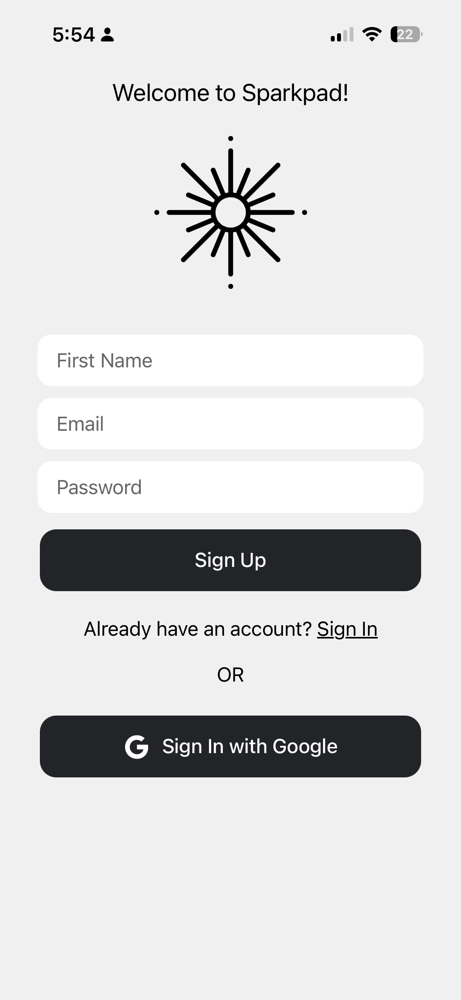
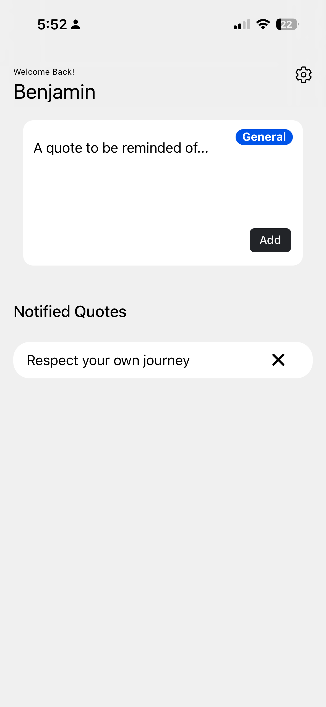

# Sparkpad

Sparkpad allows you to save quotes that resonate with you and get notified about them randomly throughout the day.

## Screenshots

<p align="center">
  
  &nbsp;&nbsp;&nbsp;
  
</p>

## Tech Stack

- [Ionic](https://ionicframework.com/) + [React](https://react.dev/)
- [Capacitor](https://capacitorjs.com/) for native iOS
- [Firebase](https://firebase.google.com/) (Auth, Firestore, Cloud Functions, Messaging)

## Getting Started

```
npm install
npm run dev
```

## Developer Docs

See [DEVELOPING.md](DEVELOPING.md) for build, deployment, and Firebase setup instructions.
